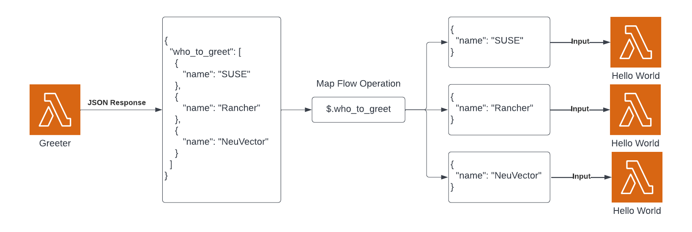

# AWS Lambda Demo

This is a simple AWS Lambda demo with the Ruby runtime.

This demo consists of two AWS Lambda functions in an AWS Step Function: `greeter` and `hello_world`. Greeter returns a JSON response of who to greet, and with a map operation, we call `hello_world` with each name to greet.



## Requirements

* An AWS account
* `ruby` 2.7
* `terraform`

## Steps

1. Run `make` to build the AWS Lambda function zip file.
2. Change directories to `terraform` and run `terraform apply`.
3. Go to the AWS web console and run the step function we just created, it should be named `default-aws-demo-greeter`.
4. Verify:
   1. Check out AWS CloudWatch, in `/aws/lambda/default-hello_world`, you should have multiple log streams, one for each `"Hello #{name}"`.
   2. Check out AWS X-Ray, you should have multiple traces:
      1. For the `greeter` function, you should have a trace over 2 seconds in duration.
      2. FOr the `hello_world`, function, you should traces with a short duration.

### Test Hello World Functions

#### Without Payload
```bash
aws lambda invoke --region eu-central-1 --output text --function-name default-hello_world --cli-binary-format raw-in-base64-out /tmp/aws-lambda-out > /dev/null && cat /tmp/aws-lambda-out
```

#### With Payload
```bash
aws lambda invoke --region eu-central-1 --output text --function-name default-hello_world --cli-binary-format raw-in-base64-out --payload '{"name": "SUSE IT"}' /tmp/aws-lambda-out > /dev/null && cat /tmp/aws-lambda-out
```

## Teardown

1. Change directories to `terraform` and run `terraform destroy`.
